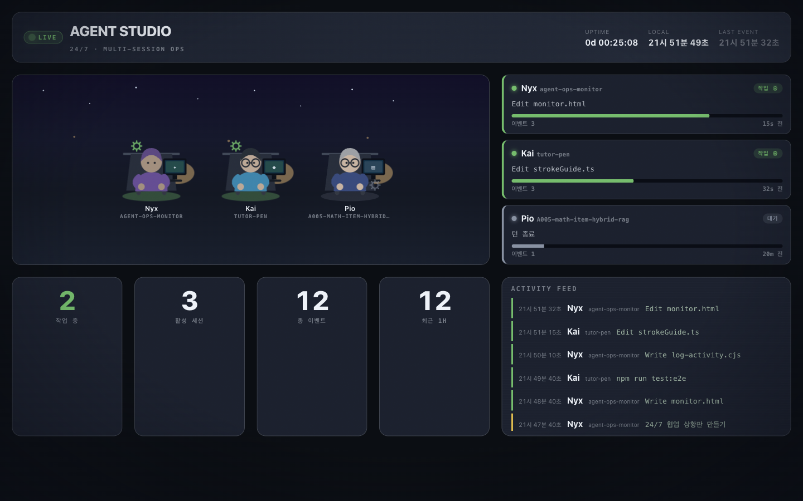

# AGENT STUDIO — 24/7 Multi-Agent Ops Monitor

여러 Claude Code 세션이 **동시에 협업하는 모습**을 실시간으로 지켜보는 관제실 스타일 대시보드입니다.
Stanford *Generative Agents*(Smallville) 논문 감성 그대로, **세션 하나 = 캐릭터 하나**로 심야 아이소메트릭 오피스에 앉아 각자 일합니다.



## 무엇을 하나

- 실행 중인 모든 Claude Code 세션(다른 터미널·다른 프로젝트 포함)의 활동을 **자동으로 수집**
- 세션마다 고유 캐릭터(헤어·의상·소품)를 배정해 오피스 씬에 배치
- 최근 활동으로 상태를 판정해 캐릭터가 살아 움직임
  - 🟢 **작업 중** — 타이핑 + 톱니바퀴 회전 + 화면 글로우
  - 🟡 **구상 중** — 머리 위 생각 말풍선(프롬프트 직후)
  - ⚪ **대기** — 잔잔한 호흡
  - 🔵 **완료** — 체크 배지 (턴 종료 후)
- **세부 에이전트(subagent) 표시** — 세션 안에서 소환한 하위 에이전트(예: `code-reviewer`, `frontend-design`)를 부모 책상 밑 "소환" 미니 아바타로 붙여 렌더
- 상태 카드 · KPI · 실시간 활동 피드(프로젝트 태그 포함)로 한눈에 스캔
- **자동 새로고침 불필요** — 3초마다 로그를 폴링해 부드럽게 갱신

## 구성

| 파일 | 역할 |
|------|------|
| `monitor.html` | 자기완결형 대시보드. 외부 의존성 0. 순수 인라인 SVG 캐릭터 + CSS 애니메이션. `activity.jsonl`을 폴링해 집계·렌더 |
| `log-activity.cjs` | Claude Code 훅 스크립트. 훅 페이로드(stdin)를 읽어 `activity.jsonl`에 JSONL 한 줄 append |
| `serve.sh` | 로컬 http 서버 실행 (`file://`은 CORS로 로그 fetch 불가) |
| `activity.jsonl` | 공유 활동 로그 (훅이 생성, `.gitignore` 처리 — 로컬 경로/명령 포함) |

## 실행

```bash
./serve.sh            # 기본 포트 9191
./serve.sh 8080       # 포트 지정
```

브라우저에서 **http://127.0.0.1:9191/monitor.html** 접속.

> `file://`로 직접 열면 브라우저 CORS 정책 때문에 로그를 읽지 못합니다. 반드시 서버로 여세요.

## 훅 연결 (모든 세션 자동 기록)

`~/.claude/settings.json`의 `hooks`에 네 이벤트를 등록하면, 이후 **모든** Claude Code 세션이 자동으로 활동을 남깁니다.
`<이-저장소-경로>`를 실제 클론 경로로 바꾸세요.

```jsonc
{
  "hooks": {
    "SessionStart":     [{ "hooks": [{ "type": "command", "command": "node <이-저장소-경로>/log-activity.cjs", "async": true }] }],
    "UserPromptSubmit": [{ "hooks": [{ "type": "command", "command": "node <이-저장소-경로>/log-activity.cjs", "async": true }] }],
    "PostToolUse":      [{ "matcher": "*", "hooks": [{ "type": "command", "command": "node <이-저장소-경로>/log-activity.cjs", "async": true }] }],
    "Stop":             [{ "hooks": [{ "type": "command", "command": "node <이-저장소-경로>/log-activity.cjs", "async": true }] }]
  }
}
```

이미 실행 중이던 세션은 해당 터미널에서 `/hooks`를 한 번 열거나(설정 리로드) 재시작해야 새 훅을 인식합니다. 새로 여는 세션은 즉시 기록됩니다.

## 웹에서 승인 (opt-in)

특정 세션에서 도구 실행 전 **웹 대시보드 버튼으로 허가/거부**할 수 있습니다. 기본은 꺼져 있고, 켜려는 터미널에서만 환경변수를 설정합니다:

```bash
export AGENT_STUDIO_WEB_APPROVE=1   # 이 터미널에서만 웹 승인 사용
claude
```

- `PreToolUse` 훅(`Bash|Write|Edit`)이 실행 전 요청을 `approvals/`에 남기고, 대시보드 상단 **동의 대기 배너**에 승인/거부 버튼이 뜹니다.
- 25초 안에 클릭이 없으면 자동으로 Claude Code **기본 프롬프트로 넘어갑니다** (행·우회 없음).
- 환경변수를 설정하지 않은 세션은 전혀 영향받지 않습니다.

> 이 기능은 `serve.sh`(= `approve-server.py`)가 `/api/pending`·`/api/decision`을 처리해야 동작합니다. 정적 `python -m http.server`로는 승인 API가 없어 작동하지 않습니다.

## 상태 판정 규칙

`monitor.html` 상단 `CONFIG` 블록에서 조정할 수 있습니다.

| 항목 | 기본값 | 의미 |
|------|--------|------|
| `POLL_MS` | 3000 | 로그 폴링 주기 |
| `RECENT_MS` | 60초 | 이보다 최근 활동이면 작업 중 |
| `DONE_MS` | 150초 | 턴 종료(Stop) 후 이 시간까지 '완료' 표시 |
| `STALE_MS` | 30분 | 이보다 오래된 세션은 씬에서 제외 |

## 만든 방식

이 대시보드 자체가 **멀티에이전트 협업**으로 만들어졌습니다.

- **디자인팀 에이전트** → 아트 디렉션 *"Night Shift Studio"*: 심야 아이소메트릭 오피스, oklch 시맨틱 상태 팔레트, 캐릭터 6종, 모션 랭귀지
- **프론트엔드팀 에이전트** → 인라인 SVG 캐릭터 패턴, transform/opacity 전용 애니메이션, 폴링·집계 엔진

## 기술 특징

- **의존성 0** — CDN·이미지·폰트 외부 로드 없음. `monitor.html` 단일 파일
- **컴포지터 친화 애니메이션** — `transform` / `opacity`만 사용
- **접근성** — `prefers-reduced-motion` 존중, 시맨틱 HTML, ARIA 라벨
- **안전한 훅** — append-only(동시성 안전), 로그 크기 자동 제한, 호스트 tool을 절대 실패시키지 않음

---

로컬 우선 · 키 불필요 · 완전 오프라인 동작.
